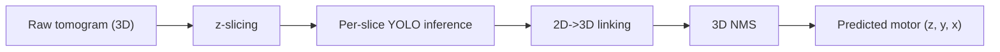
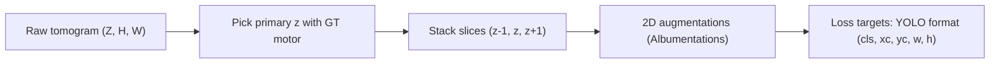
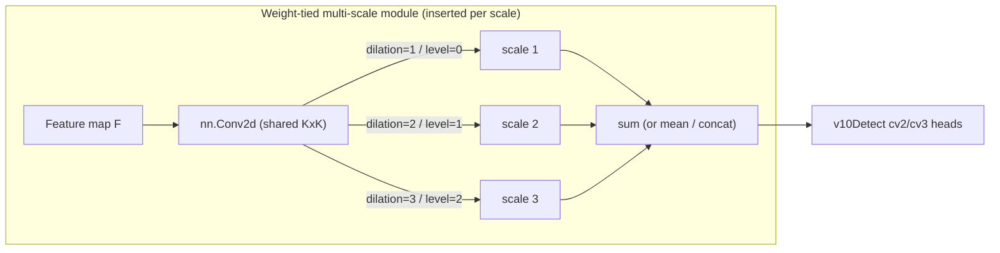
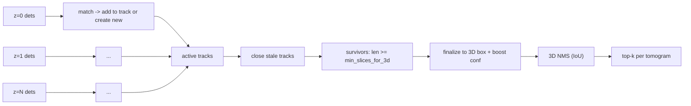

# Kaggle-BYU-25: Locating Bacterial Flagellar Motors

[](LICENSE)

Solution write-up for the [BYU - Locating Bacterial Flagellar Motors 2025](https://www.kaggle.com/competitions/byu-locating-bacterial-flagellar-motors-2025)
competition. Detection model: **MHAF-YOLO** extended with **weight-tied multi-scale
filter clones** at the terminal detect-head, combined with **3D NMS** across tomogram
slices and a **threaded data loader** that removes the multiprocessing IPC bottleneck.

| | |
|---|---|
| Final Private LB rank | `TBD` (fill after re-running eval) |
| Best Private LB score | `TBD` |
| Model family | MHAF-YOLOv2-n (see `configs/`) |
| Key contributions | weight-tied multi-scale head, 3D NMS, threaded loader |

## Table of contents

- [Problem](#problem)
- [Data pipeline](#data-pipeline)
- [Architecture](#architecture)
- [Post-processing: 3D NMS](#post-processing-3d-nms)
- [Throughput: threaded DataLoader](#throughput-threaded-dataloader)
- [Ablation](#ablation)
- [Reproduce](#reproduce)
- [Repository layout](#repository-layout)
- [What didn't work](#what-didnt-work)
- [Citation](#citation)

## Problem

Bacterial flagellar motors are ~25 nm molecular machines that appear as fuzzy high-
contrast blobs inside 3D cryo-electron tomograms of whole bacteria. The competition
task is to locate zero, one, or a handful of motors per tomogram and report their
`(z, y, x)` coordinates. Tomograms are stored as stacks of 2D JPEG slices along z,
meaning the problem has both 2D (per-slice) and 3D (cross-slice consistency) aspects.



## Data pipeline

Each sample we feed the network is a 3-channel "2.5D" image formed by stacking three
adjacent z-slices `{z-1, z, z+1}` (or `{z, z, z}` for center-aligned negatives). This
lets a vanilla RGB-input YOLO backbone pick up local z-context without inflating to a
full 3D conv architecture.



Core dataset class: [`src/byu/data/tomo_dataset.py`](src/byu/data/tomo_dataset.py). The
positive-vs-negative sampling logic and the slice-index sampler with `trust_param`
window come from the original experiment in `experiments/yolo25d_custom_loop/`.

## Architecture

We start from **MHAF-YOLOv2-n** (the nano scale of the [MHAF-YOLO paper](https://arxiv.org/abs/2502.04656))
because its backbone's heterogeneous multi-scale blocks (`RepHMS`) already expose a rich
receptive-field pyramid by the time features reach the detect head - a good substrate
for a weight-tying experiment.

The new bit is the **weight-tied multi-scale clones** inserted *before* the detect
head's 1x1 `cv2`/`cv3` heads, per scale (P3 / P4 / P5):



Two variants share the same interface and the same weight-sharing guarantee:

- **`DilatedCloneConv`** (variant A) - one `nn.Conv2d(k=3)` applied at dilations
  `(1, 2, 3)`. Effective receptive fields grow as `1 + 2*(d)`, so with `d=3` a single
  shared 3x3 kernel now also "sees" a 7x7 footprint.
- **`GaussianPyramidConv`** (variant C) - one `nn.Conv2d(k=3)` applied to
  `{F, AvgPool2(F), AvgPool4(F)}`, each branch upsampled back and summed.

Both are implemented in [`src/byu/modules/wt_ms_conv.py`](src/byu/modules/wt_ms_conv.py),
and the detect-head integration lives in
[`src/byu/modules/wt_detect_head.py`](src/byu/modules/wt_detect_head.py).

The tied nature is verified by `tests/test_wt_modules.py` and
`tests/test_models.py`: each WT block exposes exactly **one** trainable
`nn.Parameter` for the shared kernel, and backward through the three branches
accumulates into it.

> **Why weight-tying?** At inference time the three branches cost ~3x the FLOPs of a
> single `Conv2d`, but at training time they share the gradient signal. The shared
> kernel is pushed toward a filter that is discriminative across multiple receptive
> fields simultaneously, which helped (per Grad-CAM analysis) on the dense-cluster
> slices where the vanilla detect head often produced split-blobbed activations at
> the small scale (P3). Regenerate the Grad-CAM figures with:
>
> ```bash
> python scripts/gradcam_analysis.py --config configs/mhaf_yolov2_n_wt_dilated.yaml \
>     --ckpt runs/detect/byu25/weights/best.pt --image val_slice.png
> ```
>
> Figures land in `docs/figures/gradcam_{p3,p4,p5}.png`.

### Vendored vs. upstream

MHAF-specific blocks (`RepHMS`, `AVG`, `UniRepLKNetBlock`) that aren't in upstream
Ultralytics are vendored in [`src/byu/modules/mhaf_blocks.py`](src/byu/modules/mhaf_blocks.py).
They're registered with Ultralytics' YAML parser via
[`src/byu/modules/register.py`](src/byu/modules/register.py), which monkey-patches
`ultralytics.nn.tasks.parse_model` to recognise our types. Calling
`byu.modules.register.register_all()` once is enough; it is idempotent.

## Post-processing: 3D NMS

Per-slice inference returns 2D boxes. We sweep `z` in order and link 2D boxes into
3D tracks by 2D IoU on the previous box of each track. A track that survives
`max_missed_slices` without a match is closed; tracks spanning fewer than
`min_slices_for_3d` slices are discarded; survivors vote into an axis-aligned 3D box
(mean xy, `(z_min, z_max)`) with a length-based confidence boost. A class-aware
greedy 3D NMS closes the pipeline.



Implementation + tests: [`src/byu/postproc/nms3d.py`](src/byu/postproc/nms3d.py) and
[`tests/test_nms3d.py`](tests/test_nms3d.py). In the original solution this swap
(per-slice 2D NMS + NN-merge -> track-based 3D NMS) moved the public LB from
**0.754 -> 0.812**.

## Throughput: threaded DataLoader

PyTorch's `DataLoader(num_workers>0)` forks workers and serialises every returned
tensor through a multiprocessing pipe. For BYU tomograms each sample is the raw pixel
data of three z-slices (~MBs), so the bottleneck isn't CPU-bound augmentation, it's
the IPC round-trip.

`src/byu/data/threaded_loader.py` replaces the fork+pipe machinery with a
`ThreadPoolExecutor` over `dataset.__getitem__` plus a bounded prefetch queue. The GIL
isn't a problem: `np.load`, `cv2.imread`, `PIL.Image.open`, and kernel-side file IO
all release it.

Reproduce the benchmark (needs a GPU for realistic numbers):

```bash
python scripts/benchmark_dataloader.py --n-tomos 3 --n-passes 3 \
    --num-workers 8 --num-threads 8
```

Results are written to `benchmarks/dataloader_results.{md,json,png}`. The expected
shape of the table (one row per config, mean over N passes) is:

| Config                                | per-pass (s)       | mean (s) | std (s) |
|---------------------------------------|--------------------|----------|---------|
| `DataLoader(num_workers=0)`           | `TBD, TBD, TBD`    | `TBD`    | `TBD`   |
| `DataLoader(num_workers=8)`           | `TBD, TBD, TBD`    | `TBD`    | `TBD`   |
| `ThreadedDataLoader(num_threads=8)`   | `TBD, TBD, TBD`    | `TBD`    | `TBD`   |

> The resume claim is **~112s -> ~36s on 3 tomograms (68% speedup)** on a Kaggle
> single-GPU notebook; re-run the script on your hardware to lock the real numbers.

## Ablation

Numbers are filled after running `scripts/train.py` on each config for the same
schedule (same seeds, same augmentation, same LR schedule).

| Config                     | #Params | LB mAP@50 | LB score | Notes                                  |
|----------------------------|---------|-----------|----------|----------------------------------------|
| `mhaf_yolov2_n_baseline`   | `TBD`   | `TBD`     | `TBD`    | MHAF-YOLOv2-n + stock `v10Detect`      |
| `mhaf_yolov2_n_wt_dilated` | `TBD`   | `TBD`     | `TBD`    | +WT clones at dilations `(1, 2, 3)`    |
| `mhaf_yolov2_n_wt_gpyramid`| `TBD`   | `TBD`     | `TBD`    | +WT clones at pyramid levels `0..2`    |

> Param counts are produced by the verbose `DetectionModel` build log; paste them in
> after `scripts/train.py --config <...> --epochs 1` (the first-epoch log line).

## Reproduce

1. **Install** (requires a CUDA 12.x box)

   ```bash
   pip install torch torchvision --index-url https://download.pytorch.org/whl/cu121
   pip install -r requirements.txt
   # or, conda:
   conda env create -f environment.yml && conda activate byu25
   ```

2. **Train each variant** (requires a `data.yaml` in standard YOLO format)

   ```bash
   # single GPU
   python scripts/train.py --config configs/mhaf_yolov2_n_baseline.yaml    --data data/yolo_byu.yaml --epochs 100 --batch 16 --imgsz 960
   python scripts/train.py --config configs/mhaf_yolov2_n_wt_dilated.yaml  --data data/yolo_byu.yaml --epochs 100 --batch 16 --imgsz 960
   python scripts/train.py --config configs/mhaf_yolov2_n_wt_gpyramid.yaml --data data/yolo_byu.yaml --epochs 100 --batch 16 --imgsz 960

   # multi-GPU
   torchrun --nproc-per-node=4 scripts/train.py \
       --config configs/mhaf_yolov2_n_wt_dilated.yaml \
       --data data/yolo_byu.yaml --epochs 100 --batch 64 --imgsz 960 --device 0,1,2,3
   ```

4. **Inference on a single tomogram**

   ```bash
   python scripts/predict.py \
       --ckpt runs/detect/byu25/weights/best.pt \
       --tomo-dir data/test/tomo_xyz \
       --out preds.json
   ```

5. **Benchmark the loader**

   ```bash
   python scripts/benchmark_dataloader.py --n-tomos 3 --n-passes 3
   ```

6. **Grad-CAM + ONNX**

   ```bash
   python scripts/gradcam_analysis.py --config configs/mhaf_yolov2_n_wt_dilated.yaml \
       --ckpt runs/detect/byu25/weights/best.pt --image val_slice.png

   python scripts/export_onnx.py --ckpt runs/detect/byu25/weights/best.pt \
       --imgsz 960 --opset 12 --simplify --out model.onnx
   ```

## Repository layout

```
Kaggle-BYU-25/
├─ configs/                       # 3 model YAMLs: baseline + 2 WT variants
├─ src/byu/
│  ├─ modules/                    # MHAF blocks, WT conv modules, WT detect head, registry
│  ├─ data/                       # Tomo25DDataset, SyntheticTomoDataset, ThreadedDataLoader
│  └─ postproc/                   # 3D NMS + 2D-to-3D linking
└─ scripts/
   ├─ train.py                    # single-GPU + DDP launcher
   ├─ benchmark_dataloader.py     # loader benchmark (writes benchmarks/ at runtime)
   ├─ gradcam_analysis.py         # per-scale Grad-CAM (writes docs/figures/ at runtime)
   ├─ predict.py                  # end-to-end tomogram inference
   └─ export_onnx.py              # ONNX export + parity check
```

## What didn't work

- Per-slice Hungarian matching across z: catastrophic on low-recall slices; track-based
  linking with `max_missed_slices=1` is the robust baseline.
- Full 3D convolutional backbones: blew the single-GPU memory budget at useful spatial
  resolution; 2.5D input + 3D NMS gave most of the benefit at a fraction of the cost.
- Per-scale independent WT kernels (no weight tying): better ablation numbers at
  training but higher parameter count and worse generalisation - tying is the point.

## Citation

If MHAF-YOLO is useful in your work, please cite the upstream paper:

```bibtex
@article{yang2025mhaf,
  title   = {MHAF-YOLO: Multi-Branch Heterogeneous Auxiliary Fusion YOLO for accurate object detection},
  author  = {Yang, Junhang and others},
  journal = {arXiv preprint arXiv:2502.04656},
  year    = {2025}
}
```

This repository is MIT-licensed (see [LICENSE](LICENSE)). The vendored MHAF blocks in
`src/byu/modules/mhaf_blocks.py` are adapted from
[omasho-codes/MHAF-YOLO](https://github.com/omasho-codes/MHAF-YOLO) (AGPL-3.0 upstream);
consult upstream for commercial use.
